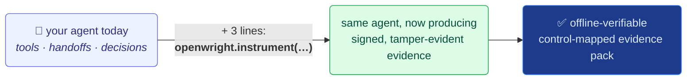

# OpenWright examples

<p>
  <a href="https://github.com/allthingsN/openwright-examples/actions"></a>
  <a href="https://github.com/allthingsN/openwright-examples/actions"></a>
  <a href="LICENSE"></a>
</p>

Runnable agents from popular frameworks, each with [OpenWright](https://github.com/allthingsN/openwright)
evidence capture added — so you can see the exact code delta and what it buys you.

We **don't vendor upstream code**. Each example **links to the original**, and ships a
single self-contained, runnable file (`main.py`) that is that agent **with OpenWright
added**. The README in each folder shows the exact delta and the benefit.

The thesis: integrating OpenWright is **three lines, agent logic untouched** —
`openwright.instrument("<framework>")` registers a global processor that turns every tool
call, handoff, and decision into signed, hashed, tamper-evident, control-mapped evidence,
checkpointed WORM (e.g. S3 Object-Lock) and verifiable offline.



## Examples

| Framework | Example | Original |
|---|---|---|
| OpenAI Agents SDK | [`examples/openai/customer_service`](examples/openai/customer_service) | [openai-agents-python · customer_service](https://github.com/openai/openai-agents-python/blob/main/examples/customer_service/main.py) |
| OpenAI Agents SDK | [`examples/openai/financial_research_agent`](examples/openai/financial_research_agent) | [openai-agents-python · financial_research_agent](https://github.com/openai/openai-agents-python/tree/main/examples/financial_research_agent) |

Both take the **same three-line change** — the financial one is a 6-agent pipeline,
showing the integration cost doesn't grow with agent complexity.

## Install & run

```bash
pip install -r requirements.txt        # openwright-core + openwright-openai-agents + openai-agents
export OPENAI_API_KEY=sk-...
export OPENWRIGHT_CHECKPOINT_STORE="s3://your-bucket/checkpoints?lock=COMPLIANCE&days=180"   # or file://./out/cp

cd examples/openai/customer_service && python main.py
openwright verify out/report.json --pubkey out/public_key.pem --deep
```

Each `main.py` is self-contained and runnable on its own (no repo-internal imports).
